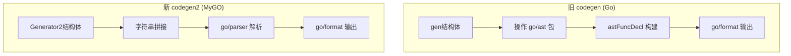
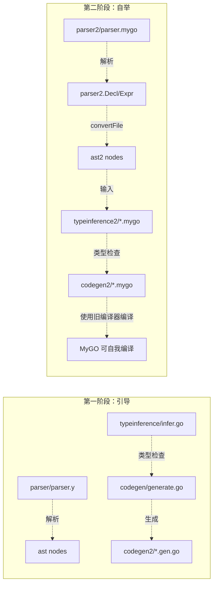

# MyGO 自举编译器与旧有 Go 编译器对比分析

## 概览

本项目（MyGO 编译器）存在两套并行实现：

| 组件 | 旧有实现（Go 实现） | 自举实现（MyGO 实现） |
|------|---------------------|----------------------|
| **词法/语法解析** | `internal/mygo/parser/`（yacc + Go） | `internal/mygo/parser2/`（parsec + MyGO） |
| **AST 定义** | `internal/mygo/ast/`（Go interface + struct） | `internal/mygo/ast2/`（MyGO enum + struct） |
| **类型推理** | `internal/mygo/typeinference/`（Go 实现） | `internal/mygo/typeinference2/`（MyGO 实现） |
| **代码生成** | `internal/mygo/codegen/`（Go 实现） | `internal/mygo/codegen2/`（MyGO 实现） |

**自举编译器的目标：** 能够自我编译，即 `codegen2` 用 MyGO 语言本身编写，然后由旧版编译器 `codegen` 编译生成 Go 代码。这样后续 MyGO 语言新特性开发就可以用 MyGO 本身完成，无需依赖旧版 Go 编译器。

---

## 1. AST 定义对比（ast vs ast2）

### 旧 AST（`ast/ast.go`）
- **实现方式**：Go interface + struct，大量使用 Go 的指针和接口机制
- **节点结构**：每个节点是一个 `struct`，通过实现接口 `declNode()` / `exprNode()` 标记
- **位置信息**：每个节点携带 `Line`、`Column`、`SourceFile` 三个字段（行号/列号/源文件名）
- **类型声明**：`TypeExpr` 是 interface，`*NamedType`、`*FuncType`、`*TupleType` 是实现
- **语句与表达式分离**：存在单独的 `Stmt` 体系（`LetStmt`、`ReturnStmt`、`AssignStmt` 等）
- **额外类型**：
  - `Constraint`：类型类约束（`using` 关键字）
  - `EnumVariant` 中的 `Fields` 是 `[]Field`（带名字和类型的字段列表）
  - 存在 `LetStmt` / `LetRecStmt` 等独立语句节点

### 新 AST（`ast2/ast2.mygo`）
- **实现方式**：MyGO 的 `enum` + `struct`，纯代数数据类型风格
- **节点结构**：使用 MyGO 的 `enum`（标签联合）表示变体
- **位置信息**：**有意省略**了位置信息（`intentionally keeps positions out`），当前假设直到 `parser2` 开始携带源码位置
- **类型声明**：`TypeExpr` 是 MyGO 的 `enum`，使用 `NamedType`、`FuncType`、`TupleType`、`UnitType`、`InlineGo` 五个变体
- **语句与表达式分离**：存在独立的 `Stmt` enum（`LetStmt`、`VarStmt`、`WhileStmt`、`ReturnStmt`、`AssignStmt`、`ExprStmt`）和 `Expr` enum（纯表达式）
  - `BlockExpr(Slice[Stmt])` 包含语句列表，而非表达式列表
  - `Expr` 不包含 let/var/while/return/assign 等语句语义
- **更简洁的结构**：
  - 没有 `Constraint` 类型
  - `EnumDecl` 和 `ImplDecl` 也存在于 ast2 中（旧版也有）
  - `Variant.Fields` 是 `Slice[TypeExpr]`（仅类型列表，没有字段名）
  - `FuncDecl` 没有 `Using []Constraint` 字段（旧版有）

### 关键差异总结

| 特性 | ast (旧) | ast2 (新) |
|------|----------|-----------|
| 语言 | Go | MyGO |
| 语句节点 | 独立 Stmt 类型 | 独立 Stmt 类型 |
| 位置信息 | 每节点携带 | 未携带 |
| 类型系统 | interface + struct | enum + struct |
| 类型类约束 | `Constraint` struct + `FuncDecl.Using` | 不支持 |
| 元数 | ~50+ 个节点类型 | ~25 个节点类型 |
| Pattern 匹配 | `Pattern`/`BindPattern` 体系 | 不支持 |
| 复合字面量 | `SliceLitExpr`/`MapLitExpr`/`SetLitExpr` | 仅 `StructLitExpr` |

---

## 2. 解析器对比（parser vs parser2）

### 旧解析器（`parser/`）
- **实现方式**：经典 **yacc** (yacc/lex) 解析器生成器
- **源文件**：
  - `parser.y`：yacc 语法规则定义
  - `lex.yy.go` / `parser_lexer.go`：词法分析器
  - `parser.go`：自动生成的解析器代码
- **架构**：典型的 lexer + parser（LALR(1)）架构
- **AST 输出**：直接产生 `ast.*` 节点
- **语言**：Go 实现，需要 `go generate` 或 Makefile 配合 yacc 工具链

### 新解析器（`parser2/`）
- **实现方式**：**parsec 组合子解析器**（Monadic Parser Combinators）
- **源文件**：`parser.mygo`（~870 行 MyGO 代码）
- **架构**：
  - 使用 `lib/text/parsec` 库（MyGO 自实现的 Parsec 库）
  - 解析器是一阶函数组合：`Parser[A]` 是一个接受 `State` 返回 `Reply[A]` 的 struct
  - 组合子：`PBind`（monadic bind）、`PChoice`（选择）、`PMap`（映射）、`PPure`（纯值）等
- **语法**：
  - 没有独立的词法分析器，使用 `lexeme` 组合子自动跳过空白
  - 中缀运算符使用 `chainLeft` 组合子实现优先级和结合性解析
  - 支持 `if ... then ... elsif ... else ... end` 块风格，以及 `if =>` 箭头风格
  - `bodyExprFromBlock()` 特殊逻辑：从 `then`/`elsif`/`else` 的 block 中提取单个表达式作为分支值（单语句块直接返回该语句的表达式，多语句块返回 `BlockExpr`）
- **AST 输出**：产生 `parser2.Decl` / `parser2.Expr`（parser2 自己的 AST 类型），由 `codegen2` 中的 `convertFile` 转换为 `ast2.File`

### 关键差异总结

| 特性 | parser (旧) | parser2 (新) |
|------|-------------|---------------|
| 语言 | Go (yacc) | MyGO (parsec) |
| 解析技术 | LALR(1) 表驱动 | 递归下降组合子 |
| 独立性 | 依赖 yacc 工具链 | 纯 MyGO，零外部依赖 |
| 词法分析 | 独立 lexer | parsec 组合子嵌入 |
| 错误处理 | 行号/列号 | parsec `ParseError` |
| 扩展性 | 改语法需修改 .y 文件并重新生成 | 改语法即改 MyGO 函数 |
| AST 输出 | 直接产生 `ast.*` | 产生 `parser2.*`，再转换 |

---

## 3. 类型推理对比（typeinference vs typeinference2）

### 旧类型推理（`typeinference/`）
- **规模**：**~4500+ 行** Go 代码（`infer.go` 约 2800 行 + `solver.go` + `unify.go` + `go_imports.go`）
- **类型系统**：完整 Hindley-Milner（Algorithm W）+ 带约束的类型类（typeclass）
- **核心类型**：
  - `MonoType` 接口：`TVar`、`TKVar`（高阶类型变量）、`TCon`、`TFunc`、`TGoPackage`、`TUnit`
  - `Scheme`：`Bound []int` + `Body QualifiedType`
  - `QualifiedType`：`Predicates []Predicate` + `Body MonoType`
- **核心功能**：
  - `Instantiate`：实例化多态类型方案
  - `Generalize`：泛化（将自由类型变量量化为 forall）
  - `InferPackage`：对整个包运行 HM 推理
  - 支持 `using Constraint` 类型类约束
  - 支持 HKT（Higher-Kinded Types）
  - 支持 Go 包的导入和类型导入
  - 存储 `TypedInfo`（表达式 → 类型映射）供代码生成器使用
- **子类型**：
  - `solver.go`：约束求解器
  - `unify.go`：合一算法
  - `go_imports.go`：Go 包导入处理

### 新类型推理（`typeinference2/`）
- **规模**：~700 行 MyGO 代码（`types.mygo` 77 行 + `infer.mygo` 389 行 + `unify.mygo` + `utils.mygo` + `env.mygo`）
- **类型系统**：极简的 Hindley-Milner（HM）子集，**不支持类型类**
- **核心类型**（`MonoType` 枚举）：
  - `TVar(Int)`：类型变量（用 Int ID 表示）
  - `TCon(String, Slice[MonoType])`：类型构造器
  - `TFunc(Slice[MonoType], Ref[MonoType])`：函数类型
  - `TTuple(Slice[MonoType])`：元组类型
  - `TUnit`：单元类型
- **Scheme 结构**：`Bound: Slice[Int]` + `Body: MonoType`（旧版用 `QualifiedType`，新版简化为直接绑 `MonoType`）
- **核心实现**：
  - `unify`：标准合一
  - `applySubst`：替换应用
  - `composeSubst`：替换组合
  - `inferExpr`：对表达式进行类型推断（模式匹配）
  - `inferDecl`：对声明进行类型推断
  - `inferStmt`：对语句进行类型推断（`LetStmt`、`VarStmt`、`WhileStmt`、`AssignStmt`、`ReturnStmt` 等）
  - `inferBlock`/`inferBlockItems`：块级语句推理
- **输出类型**：`PackageInfo`（包含 `Env: Slice[EnvEntry]` 和 `Fields: Slice[FieldEntry]`），而非旧版的 `TypedInfo`（表达式→类型映射）
- **文件组织**：
  - `types.mygo`：类型定义 + `InferFile` 入口
  - `infer.mygo`：推理核心
  - `unify.mygo`：合一算法
  - `utils.mygo`：工具函数
  - `env.mygo`：环境查找

### 关键差异总结

| 特性 | typeinference (旧) | typeinference2 (新) |
|------|---------------------|---------------------|
| 语言 | Go（~4500 行） | MyGO（~700 行） |
| 类型类 | ✅ 完整支持（`using` 约束） | ❌ 不支持 |
| HKT | ✅ 支持高阶类型 | ❌ 不支持 |
| Go 互操作 | ✅ 支持 Go 类型导入 | ❌ 通过 `InlineGo` 嵌入 |
| 包间推理 | ✅ 跨包类型推理 | ❌ 单文件推理 |
| 多态泛化 | ✅ `Generalize` | 基本的 let 泛化 |
| 约束求解 | ✅ `solver.go` | ❌ 无 |
| 类型映射 | `TypedInfo`（表达式→类型映射） | `PackageInfo`（环境变量+字段映射） |
| 类型类方法 | ✅ `using` 约束函数参数 | ❌ 不支持 |
| 语句推理 | ✅ 完整支持 | ✅ 完整支持（`inferStmt`） |

---

## 4. 代码生成对比（codegen vs codegen2）

### 旧代码生成器（`codegen/`）
- **规模**：~5000+ 行 Go 代码，跨越 10+ 个文件
- **输出方式**：直接操作 `go/ast` 包，构造 Go AST 再通过 `go/format` 格式化为字符串
- **包管理**：完整的包级处理（`Package` 类型），支持多文件输出
- **Prelude 处理**：特殊逻辑处理 prelude 包（自动 dot-import）
- **类型类支持**：通过 `genTypedImpl`、`genInherentDecls` 等方法实现复杂的方法分发
- **HKT 支持**：`genHKTDecls` 生成高阶类型辅助声明
- **内联 Go 嵌入**：支持 `go[T] { ... }` 语法
- **泛型约束**：支持 `using` 约束参数

### 新代码生成器（`codegen2/`）
- **规模**：~900+ 行 MyGO 代码（`codegen2.mygo` 73 行 + `decls.mygo` 222 行 + `gofile.mygo` 264 行 + `translate_expr.mygo` + `types.mygo` + `types_util.mygo` + `tailcall.mygo`）
- **输出方式**：字符串拼接生成 Go 源码，然后通过 `go/parser` 和 `go/format` 格式化
  - 关键实现：`renderGoFile()` 使用内联 Go 嵌入（`go[Result[String, String]] { code: "..." }`）拼接包声明+import+声明，再用 `go/parser.ParseFile` 解析各部分 AST 后合并输出
- **包管理**：简单的文件级处理，通过 `GenerateFiles` 支持多文件
- **Prelude 处理**：不需要特殊逻辑
- **类型类支持**：**不支持**
- **HKT 支持**：**不支持**
- **内联 Go 嵌入**：通过 `renderGoFile` 的 `go[T] { ... }` 原样嵌入
- **代码组织（`codegen2/` 文件分布）**：
  - `codegen2.mygo`：入口和主流程
  - `decls.mygo`：声明翻译（struct/enum/interface/impl/func）
  - `translate_expr.mygo`：表达式翻译
  - `gofile.mygo`：Go 文件生成/渲染 + parser2 → ast2 转换
  - `types.mygo`：翻译上下文（`egCtx`、`Generator2`）定义和操作
  - `types_util.mygo`：类型映射和命名工具
  - `tailcall.mygo`：尾递归优化

### 代码生成关键差异

| 特性 | codegen (旧) | codegen2 (新) |
|------|--------------|---------------|
| 语言 | Go | MyGO |
| 输出方式 | `go/ast` 构造 → format | 字符串拼接 → parse → format |
| 包支持 | 完整包级处理 | 基本文件级 |
| 泛型约束 | 支持 `using` | 不支持 |
| HKT | 支持 | 不支持 |
| 尾递归优化 | ❌ | ✅ 支持 |
| 方法符号命名 | 相同 mangling 算法 | 相同（代码复用） |
| 类型映射 | `goTypeInner` | `goType` |

---

## 5. 核心差异总结

### 设计理念差异

| 维度 | 旧有编译器 (Go) | 自举编译器 (MyGO) |
|------|-----------------|-------------------|
| 实现语言 | Go | MyGO |
| 设计目标 | 功能完整的产品级编译器 | 最小可自举的子集 |
| 代码规模 | ~10000+ 行 | ~2300+ 行（ast2 45 行 + parser2 870 行 + typeinference2 700 行 + codegen2 900 行） |
| 类型系统 | HM + Typeclass + HKT | 简单 HM 子集 |
| 解析器 | yacc/LALR(1) | parsec 组合子 |
| 泛型实现 | 完整泛型 + 约束 | 仅基础泛型 |
| Go 互操作 | 直接调用 Go 包 | 通过 `go[T]{ ... }` 嵌入 |

### 架构演进路线

### 自举策略的关键设计选择

1. **最小化语言子集**：`codegen2` 只实现了 MyGO 功能的最小子集（无类型类、无 HKT、无缝合类型类），降低引导负担
2. **紧凑 AST**：`ast2` 去除了位置信息、Pattern 匹配体系、复合字面量（SliceLit/MapLit/SetLit）等非核心部分，但**保留了独立的 `Stmt` 类型**以简化自举代码
3. **Parsec 库自托管**：`lib/text/parsec/` 也用 MyGO 编写，使得整个解析器可以完全自举
4. **内联 Go 嵌入**：`go[T]{ code: "..."; in x = expr }` 语法允许在自举代码中嵌入原生 Go 代码，处理无法用纯 MyGO 表达的操作
5. **渐进式替换**：现有 Go 编译器仍可编译所有 MyGO 源码，新编译器逐步扩展以达到完全自举