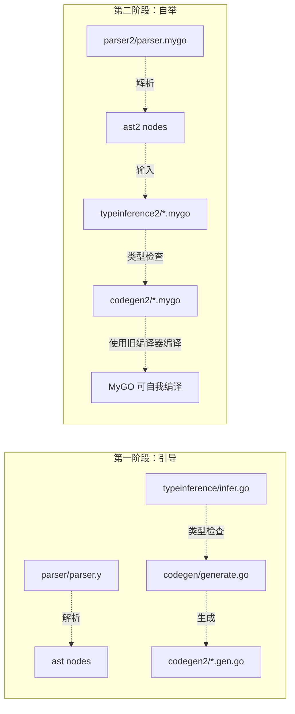

# MyGO 自举编译器与旧有 Go 编译器对比分析

> **最后更新：** 2026-07-23
>
> 本文档对比旧有 Go 编译器（`internal/mygo/`）与自举编译器（`internal/mygo/*2/`）的各组件实现情况，
> 标注已实现/未实现的功能缺口，用于指导自举编译器的后续开发。

## 概览（2026-07-23 更新）

本项目（MyGO 编译器）存在两套并行实现：

| 组件 | 旧有实现（Go 实现） | 自举实现（MyGO 实现） |
|------|---------------------|----------------------|
| **词法/语法解析** | `internal/mygo/parser/`（yacc + Go） | `internal/mygo/parser2/`（parsec + MyGO） |
| **AST 定义** | `internal/mygo/ast/`（Go interface + struct） | `internal/mygo/ast2/`（MyGO enum + struct） |
| **类型推理** | `internal/mygo/typeinference/`（Go 实现） | `internal/mygo/typeinference2/`（MyGO 实现） |
| **代码生成** | `internal/mygo/codegen/`（Go 实现） | `internal/mygo/codegen2/`（MyGO 实现） |

**自举编译器的目标：** 能够自我编译，即 `codegen2` 用 MyGO 语言本身编写，然后由旧版编译器 `codegen` 编译生成 Go 代码。这样后续 MyGO 语言新特性开发就可以用 MyGO 本身完成，无需依赖旧版 Go 编译器。

---

## 状态速览（2026-07-23 更新）

### 已实现的子集 ✅

| 特性 | 状态 | 备注 |
|------|------|------|
| 包声明、import 声明 | ✅ 完整 | — |
| 函数声明（含类型参数） | ✅ 完整 | — |
| 结构体声明（含类型参数、Go struct tag） | ✅ 完整 | — |
| 枚举声明（含类型参数） | ✅ 完整 | — |
| 接口声明（含类型参数） | ✅ 完整 | — |
| impl 块（固有实现 + 接口实现） | ✅ 完整 | — |
| let/var/letrec 变量绑定 | ✅ 完整 | letrec 有显式类型注解 |
| 元组解构声明 | ✅ 完整 | `TupleLetStmt` 在 ast2/parser2/infer2/codegen2 均完整 |
| while 循环 | ✅ 完整 | — |
| 赋值语句 | ✅ 完整 | — |
| return（无值 / 带值） | ✅ 完整 | — |
| if => / if ... then ... elsif ... else ... end | ✅ 完整 | — |
| switch ... case => ... end | ✅ 完整 | — |
| 函数字面量 | ✅ 完整 | — |
| 二元运算符（算术、比较、管道 \|>\ / <|\ 、\|\|、&&） | ✅ 完整 | 带优先级和结合性 |
| 一元运算符（`!`、`-`） | ✅ 完整 | — |
| 链式调用（函数调用、字段访问、as 类型断言） | ✅ 完整 | — |
| 切片字面量 `[a, b, c]` | ✅ 完整 | — |
| 结构体字面量 `T{...}` 和泛型 `T[T]{...}` | ✅ 完整 | — |
| 元组表达式 | ✅ 完整 | 仅 `TupleExpr`，无括号字面量变体 |
| Inline Go 嵌入（类型 / 表达式 / 语句） | ✅ 完整 | — |
| 模式匹配（通配符、字面量、变体/元组解构） | ✅ 完整（仅 switch 内） | `VariantPattern` + `TuplePattern` + `WildcardPattern` + `LiteralPattern` |
| HM 类型推理（单文件、let 多态） | ✅ 完整（基础 HM） | `instantiate`/`generalize` 已使用 `Scheme.Bound`；类型类谓词求解仍未完成 |
| 尾递归优化 | ✅ 完整 | — |
| 字符串拼接生成 Go 源码 + go/parser + go/format | ✅ 完整 | — |
| 类型类名称 mangle（固有/接口 impl） | ✅ 与旧版一致 | — |
| Map/Set 字面量解析 | ✅ 完整 | ast2 `MapLitExpr`/`SetLitExpr`、parser2 `mapLiteral()`/`setLiteral()` |
| Map/Set 字面量类型推理 | ✅ 完整 | `inferMapLit`/`inferSetLit` + tail |
| Map/Set 字面量代码生成 | ✅ 完整 | `translateMapLitAstExpected`/`translateSetLitAstExpected` |
| using 约束解析 | ✅ 完整 | ast2 `Constraint` 枚举、`FuncDecl.Using`、`FuncSig.Using`、parser2 `usingClause()`/`constraint()` |
| Predicate / QualifiedType 类型定义 | ✅ 完整 | typeinference2 `types.mygo` 定义 |
| TGoPackage | ✅ 完整 | unified、substituted、used in env |

### 未实现的缺口 ⚠️

| # | 特性 | 旧版状态 | 新版状态 | 影响 |
|---|------|---------|---------|------|
| 1 | **类型类约束（`using`）** | ✅ 完整 | ✅ 约束已贯通推理与代码生成 | 类型类方法调用、impl dispatch |
| 2 | **高阶类型（HKT）** | ✅ 完整 | ⚠️ 类型变量及辅助声明已完成，完整 HKT 类型推理仍未实现 | 泛型接口（如 `IEnumerable[C[A], A]`）|
| 3 | **Map/Set 字面量** | ✅ 完整 | ✅ 完整 | `{"a": 1}` 和 `{"a"}` 解析和生成 — 已实现 |
| 4 | **`embed` 声明** | ✅ 完整 | ❌ 未实现 | 内嵌外部资源 |
| 5 | **位置信息** | ✅ 每节点有 Line/Column/SourceFile | ⚠️ 有意省略 | 错误消息无行号 |
| 6 | **`TKVar` 匹配** | ✅ 完整 | ✅ 完整 | 已覆盖 unify、替换、occurs 检查、相等性比较、自由变量收集和字符串化 |
| 7 | **`TupleLitExpr`（括号元组字面量）** | ✅ 完整 | ⚠️ 使用 `TupleExpr` 表示 | 语义不完全等价，parser2 的 `tupleOrParenExpr()` 生成 `TupleExpr` |
| 8 | **`TuplePattern` / `BindPattern`** | ✅ 完整 | ✅ 完整 | 元组和绑定模式均已解析、推理并生成 |
| 9 | **LiteralExpr / UnitLitExpr 合并变体** | ✅ 单一结构体 | ❌ 拆为四种 | 语义相同但 AST 设计不同（Number/String/Rune/Bool vs 合并） |
| 10 | **跨包类型推理** | ✅ `InferPackage` 多文件 | ✅ `InferPackage` 多文件 | 支持包级类型检查 |
| 11 | **Go 包导入类型解析** | ✅ `TGoPackage` + `loadMyGoPackageInfo` | ✅ `TGoPackage` 枚举变体 + `PackageInfo.GoPackages` | `TGoPackage` 注册到 env，codegen 可获取 |
| 12 | **`TypedInfo`** | ✅ 表达式→类型映射 | ⚠️ `PackageInfo`（仅变量映射） | 代码生成无法查询表达式类型 |
| 13 | **`Instantiate`/`Generalize`** | ✅ 完整 | ✅ 基础实现 | `instantiate` 在查找点替换量化变量，`generalize` 计算环境差集；尚未覆盖谓词量化 |
| 14 | **`Predicate` + `QualifiedType`** | ✅ 完整 | ✅ 已参与推理与代码生成 | 谓词随 `InferResult` 传递，实例化时替换类型变量，调用时合并并供字典注入 |
| 15 | **`TKVar`（高阶类型变量）** | ✅ 完整 | ✅ 类型层已完成 | 已支持类型推理基础操作；HKT 完整推理仍未实现 |
| 16 | **`freeVarsMT`/`freeVarsScheme`** | ✅ 完整 | ✅ 完整 | 已用于自由变量收集；完整多态泛化仍未完成 |
| 17 | **测试包 dot-import** | ✅ 自动注入 | ❌ 不支持 | 测试文件无法引用主包符号 |
| 18 | **`CallExpr.TypeArgs`** | ✅ 泛型调用类型参数 | ✅ 完整 | ast2、parser2、推理和 codegen2 均支持 |
| 19 | **`TuplePattern`** | ✅ 完整 | ✅ 完整 | 已支持解析、类型检查和代码生成 |
| 20 | **`BindPattern`** | ✅ `BindName`/`BindTuple` | ✅ 完整 | 支持变体参数和 switch 分支中的局部绑定 |

---

## 1. AST 定义对比（ast vs ast2）

### 旧 AST（`ast/ast.go`）— 501 行

| 特性 | 实现 |
|------|------|
| 实现方式 | Go interface + struct，大量使用 Go 指针和接口 |
| 位置信息 | 每节点携带 `Line`、`Column`、`SourceFile` |
| 类型声明 | `TypeExpr` 是 interface，`*NamedType`/`*FuncType`/`*TupleType` 是实现 |
| 语句/表达式分离 | 独立的 `Stmt` 体系（`LetStmt`、`ReturnStmt`、`AssignStmt` 等） |
| 额外类型 | `Constraint`、`BindPattern`/`TuplePattern`、`MapLitExpr`/`SetLitExpr`、`TupleLitExpr`/`UnitLitExpr`、`LiteralExpr`（合并版） |

### 新 AST（`ast2/ast2.mygo`）— 165 行（21 struct/enum 节点）

- **节点结构**：使用 MyGO 的 `enum`（标签联合）表示变体
- **位置信息**：**有意省略**了位置信息，当前假设直到 `parser2` 开始携带源码位置
- **类型声明**：`TypeExpr` 是 MyGO 的 `enum`，有 5 个变体：`NamedType`、`FuncType`、`TupleType`、`UnitType`、`InlineGo`
- **语句与表达式分离**：存在独立的 `Stmt` enum 和 `Expr` enum
  - `BlockExpr(Slice[Stmt])` 包含语句列表
  - `Expr` 不包含 let/var/while/return/assign 等语句语义
- **Constraint**：✅ 已添加 `Constraint` 结构体（`Name` / `BindName` / `Args`）
- **Variant.Fields** 是 `Slice[TypeExpr]`（仅类型列表） — 不变
- **FuncDecl.Using**：✅ 已添加 `Using []Constraint`
- **FuncDecl.Ret** 是 `Option[TypeExpr]`（旧版是必需的 `TypeExpr`） — 不变
- **InterfaceDecl.Methods** 是 `[]FuncSig`（仅签名，旧版是 `[]*FuncDecl`） — 不变
- **ImplDecl** 更简洁：仅 `tps/target/iface/methods` — 不变
- **LetStmt/VarStmt** 区分不可变/可变绑定 — 不变
- **ReturnStmt/ReturnWithStmt** 区分无值/带值返回 — 不变
- **TupleLetStmt**：✅ 新增独立 stmt 变体处理元组解构（旧版在 `LetStmt.Names` 字段中）
- **MapLitExpr/SetLitExpr**：✅ 新增 `MapLitExpr(Slice[(Expr, Expr)])` 和 `SetLitExpr(Slice[Expr])`
- **GoOperand/GoTypeOperand**：✅ 新增结构体用于 InlineGo
- **StructLitField/StructLitHead**：✅ 新增结构体
- **缺少**：`TupleLitExpr`、`UnitLitExpr`、`BindPattern`

### 关键差异总结

| 特性 | ast (旧, ~50 节点) | ast2 (新, ~25 节点) |
|------|-------------------|---------------------|
| 语言 | Go | MyGO |
| 位置信息 | 每节点携带 | 未携带 |
| 类型系统 | interface + struct | enum + struct |
| 类型类约束 | `Constraint` + `FuncDecl.Using` | ⚠️ 已解析并存储，未用于推理/代码生成 |
| Pattern 匹配 | `Pattern`/`BindPattern`（含 `TuplePattern`） | ⚠️ `VariantPattern`/`TuplePattern`/`WildcardPattern`/`LiteralPattern`，仍缺 `BindPattern` |
| 复合字面量 | `SliceLitExpr`/`MapLitExpr`/`SetLitExpr` | ✅ 已添加 `MapLitExpr`/`SetLitExpr` |
| `CallExpr.TypeArgs` | ✅ 泛型调用类型参数 | ✅ 完整 |
| `TupleLitExpr` | ✅ 括号元组 | ❌ 无此变体，使用 `TupleExpr` |
| `LiteralExpr` | ✅ 单一结构体 | ❌ 拆为 Number/String/Rune/Bool |
| `EnumVariant.Fields` | `[]Field`（带位置） | `Slice[TypeExpr]`（无位置） |

---

## 2. 解析器对比（parser vs parser2）

### 旧解析器（`parser/`）

- **实现方式**：经典 **yacc** (yacc/lex) 解析器生成器
- **源文件**：`parser.y`、`lex.yy.go`、`parser_lexer.go`、`parser.go`
- **架构**：典型的 lexer + parser（LALR(1)）架构
- **语法覆盖**：完整的 MyGO 语法，包括 `using` 约束、`embed` 声明（内嵌为 struct 字段）、`MapLitExpr`/`SetLitExpr` 字面量、`TuplePattern`、`BindPattern`、`CallExpr.TypeArgs` 等
- **冲突数**：~29 shift/reduce + 4 reduce/reduce（由设计产生）
- **AST 输出**：直接产生 `ast.*` 节点（含位置信息）
- **语言**：Go 实现，需要 `go generate` 配合 yacc 工具链

### 新解析器（`parser2/`）

- **实现方式**：**parsec 组合子解析器**（Monadic Parser Combinators）
- **源文件**：`parser.mygo`（1147 行 MyGO 代码）
- **架构**：
  - 使用 `lib/text/parsec` 库（MyGO 自实现的 Parsec 库）
  - 解析器是一阶函数组合：`Parser[A]` 是一个接受 `State` 返回 `Reply[A]` 的 struct
  - 组合子：`PBind`（monadic bind）、`PChoice`（选择）、`PMap`（映射）、`PPure`（纯值）等
- **语法**：
  - 没有独立的词法分析器，使用 `lexeme` 组合子自动跳过空白
  - 中缀运算符使用 `chainLeft` 组合子实现优先级和结合性解析
  - 支持 `if ... then ... elsif ... else ... end` 块风格，以及 `if =>` 箭头风格
  - `bodyExprFromBlock()` 特殊逻辑：从 `then`/`elsif`/`else` 的 block 中提取单个表达式作为分支值
  - `typeParam()` 将 HKT 参数保存为字符串形式（如 `C[A]`），保留 kind 信息
  - `mapLiteral()` / `setLiteral()` 分别解析 Map/Set 字面量
  - `usingClause()` / `constraint()` 解析类型类约束
- **AST 输出**：产生 `ast2.File`（直接输出 ast2 节点）

### 关键差异总结

| 特性 | parser (旧) | parser2 (新) |
|------|-------------|--------------|
| 语言 | Go (yacc) | MyGO (parsec) |
| 解析技术 | LALR(1) 表驱动 | 递归下降组合子 |
| 独立性 | 依赖 yacc 工具链 | 纯 MyGO，零外部依赖 |
| 错误处理 | 行号/列号 | parsec `ParseError` |
| 扩展性 | 改语法需修改 .y 文件并重新生成 | 改语法即改 MyGO 函数 |
| AST 输出 | 直接产生 `ast.*` | 直接产生 `ast2.*` |
| `using` 约束 | ✅ 完整解析 | ✅ 完整解析（`usingClause()` / `constraint()`） |
| `embed` 声明 | ✅ 内嵌为 struct 字段 | ❌ 未实现 |
| Map/Set 字面量 | ✅ `MapLitExpr`/`SetLitExpr` | ✅ `mapLiteral()` / `setLiteral()` |
| TuplePattern | ✅ 完整 `TuplePattern` | ✅ 完整 |
| `BindPattern` | ✅ `BindName`/`BindTuple` | ❌ 未实现 |
| `CallExpr.TypeArgs` | ✅ 泛型调用类型参数 | ✅ 完整 |

---

## 3. 类型推理对比（typeinference vs typeinference2）— 2026-07-23 更新

### 旧类型推理（`typeinference/`）— ~4500+ 行 Go 代码

- **类型系统**：完整 Hindley-Milner（Algorithm W）+ 带约束的类型类（typeclass）
- **核心类型**：
  - `MonoType` 接口：`TVar`、`TKVar`（高阶类型变量）、`TCon`、`TFunc`、`TGoPackage`、`TUnit`
  - `Scheme`：`Bound []int` + `Body QualifiedType`（含谓词）
  - `QualifiedType`：`Predicates []Predicate` + `Body MonoType`
- **核心功能**：
  - `Instantiate`：实例化多态类型方案
  - `Generalize`：泛化（将自由类型变量量化为 forall）
  - `InferPackage`：对整个包运行 HM 推理
  - 支持 `using Constraint` 类型类约束
  - 支持 HKT（Higher-Kinded Types）
  - 支持 Go 包的导入和类型导入（`TGoPackage`）
  - 存储 `TypedInfo`（表达式→类型映射）供代码生成器使用
  - 多包推理：`MyGoPackageInfo` 缓存
  - `freeVarsMT`/`freeVarsQual`/`freeVarsScheme`：自由变量计算
  - `ContainsTypeVariable`：含类型变量检测
- **子类型**：
  - `solver.go`：约束求解器
  - `unify.go`：合一算法
  - `go_imports.go`：Go 包导入处理

### 新类型推理（`typeinference2/`）— MyGO 源码及生成 Go 代码

- **类型系统**：Hindley-Milner 子集，**部分支持类型类谓词**
- **核心类型**（`MonoType` 枚举，7 变体）：
  - `TVar(Int)`、`TKVar(Int)`、`TCon(String, Slice[MonoType])`、`TFunc(Slice[MonoType], Ref[MonoType])`、`TTuple(Slice[MonoType])`、`TUnit`、`TGoPackage(String)`
- **Scheme 结构**：`Bound: Slice[Int]` + `Predicates: Slice[Predicate]` + `Body: MonoType`（已添加谓词支持）
- **核心实现**：
  - `unify`、`applySubst`、`composeSubst`：标准 HM 合一
  - `inferExpr`、`inferDecl`、`inferStmt`：表达式/声明/语句推理
  - `inferBlock`/`inferBlockItems`：块级语句推理
  - `envWithPattern`：模式匹配类型检查（变体/字面量/通配符）
  - `inferVariants`：枚举变体构造器类型推断
  - `inferStructLit`/`inferGenericStructLit`：结构体字面量类型推断
  - `matchExpected`：辅助匹配函数
  - `inferMapLit`/`inferMapLitTail`：Map 字面量类型推断
  - `inferSetLit`/`inferSetLitTail`：Set 字面量类型推断
  - `collectGoPackageImports` / `seedGoPackageEnv`：Go 包导入注册
- **文件组织**：
  - `types.mygo`：类型定义 + `InferFile` 入口
  - `infer.mygo`：推理核心
  - `unify.mygo`：合一算法
  - `utils.mygo`：工具函数
  - `env.mygo`：环境查找
- **输出类型**：`PackageInfo`（包含 `Env`、`Fields`、`GoPackages`）

**当前实现覆盖：**

| 推理功能 | 状态 |
|---------|------|
| 单文件 HM 推理 | ✅ |
| 多文件包级推理 | ✅ `InferPackage` |
| let 绑定泛化 | ⚠️ 有简单泛化，但 `Scheme.Bound` 未真正使用 |
| 枚举变体构造器类型 | ✅ |
| 模式匹配类型检查 | ✅ |
| 结构体字面量类型推断 | ✅ |
| Map/Set 字面量推断 | ✅ `inferMapLit`/`inferSetLit` + tail |
| Go 包导入注册 | ✅ `collectGoPackageImports` / `seedGoPackageEnv` |
| TGoPackage unify/subst | ✅ unified、substituted、used in env |
| 自由变量计算 | ✅ `freeVarsMT` / `freeVarsScheme` |
| 实例化/泛化（基础） | ✅ `instantiate` / `generalize`；谓词量化仍未完成 |
| 类型类谓词 | ⚠️ `Predicate` 已定义且用于解析约束，未参与推理 |
| TKVar | ✅ 已覆盖合一、替换、occurs 检查、相等性比较、自由变量收集和字符串化 |

### 关键差异总结

| 特性 | typeinference (旧, ~4500 行) | typeinference2 (新, ~1260 行) |
|------|-----------------------------|-------------------------------|
| 类型类 | ✅ 完整支持（`using` 约束） | ⚠️ `Predicate` 已定义且解析，未参与推理 |
| HKT | ✅ 支持高阶类型（`TKVar`） | ⚠️ `TKVar` 类型操作已实现，但 HKT 声明生成未实现 |
| Go 互操作 | ✅ 支持 Go 类型导入（`TGoPackage`） | ✅ `TGoPackage` 已实现并用于 env |
| 包间推理 | ✅ `InferPackage` 多文件 | ✅ `InferPackage` 多文件 |
| 多态泛化 | ✅ `Generalize` + `Instantiate` + `freeVarsScheme` | ✅ 基础 `generalize` + `instantiate` |
| 约束求解 | ✅ `solver.go` | ❌ 无 |
| 类型映射 | `TypedInfo`（表达式→类型映射） | `PackageInfo`（仅变量映射） |
| 谓词系统 | ✅ `Predicate` + `QualifiedType` | ✅ 已定义并用于约束转换 |
| 多态自由变量 | ✅ `freeVarsMT`/`freeVarsQual` | ✅ `freeVarsMT`/`freeVarsScheme` |
| 类型变量检测 | ✅ `ContainsTypeVariable` | ❌ 无 |
| 测试包 dot-import | ✅ 自动注入 | ❌ 不支持 |
| 语句推理 | ✅ 完整支持 | ✅ 完整支持（`inferStmt`） |

---

## 4. 代码生成对比（codegen vs codegen2）

### 旧代码生成器（`codegen/`）— ~5000+ 行 Go 代码，12 个文件

- **输出方式**：直接操作 `go/ast` 包，构造 Go AST 再通过 `go/format` 格式化为字符串
- **包管理**：完整的包级处理（`Package` 类型），支持多文件输出
- **Prelude 处理**：特殊逻辑处理 prelude 包（自动 dot-import），`declsNeedPreludeImport`/`preludeImportNames`/`loadPreludePackageForEnums`
- **类型类支持**：`genTypedImpl`、`genInherentDecls` 等方法实现复杂的方法分发
- **HKT 支持**：`genHKTDecls` 生成高阶类型辅助声明（`HKTType`、`HKT1`、`HKT2`、`HKT`），`hktParams` 检测接口方法中的 HKT 参数
- **泛型约束**：`using` 约束参数（通过 `constraintFuncs`/`typeclassMethods`/`egTcBinding`）
- **`TypedInfo` 使用**：`inferredType(e)` 查询表达式推断类型

### 新代码生成器（`codegen2/`）— MyGO 源码及生成 Go 代码

- **输出方式**：字符串拼接生成 Go 源码，然后通过 `go/parser` 和 `go/format` 格式化
  - 关键实现：`renderGoFile()` 使用内联 Go 嵌入（`go[Result[String, String]] { code: "..." }`）
- **代码组织（`codegen2/` 文件分布）**：
  - `codegen2.mygo`：入口和主流程（112 行）
  - `decls.mygo`：声明翻译（struct/enum/interface/impl/func）（353 行）
  - `translate_expr.mygo`：函数体降低 + 表达式翻译（371 行）
  - `translate_ast.mygo`：值位置翻译 + 控制流降低（557 行）
  - `gofile.mygo`：Go 文件生成/渲染（95 行）
  - `types.mygo`：翻译上下文（`egCtx`、`Generator2`）定义（84 行）
  - `types_util.mygo`：类型映射和命名工具（626 行）
  - `tailcall.mygo`：尾递归优化（84 行）

`codegen2` 的 MyGO 源码已经由旧版编译器生成对应的 `.gen.go` 文件，并有 `codegen2_test.go` 覆盖基本生成流程。

**当前实现覆盖：**

| 代码生成特性 | 状态 | 备注 |
|-------------|------|------|
| struct/enum/interface/impl/func 翻译 | ✅ 完整 | — |
| 函数体降低（语句→Go 语句） | ✅ 完整 | — |
| 表达式翻译（值位置） | ✅ 完整 | — |
| 字符串拼接 + go/parser 验证 + go/format | ✅ | — |
| 类型参数泛型生成 | ✅ | — |
| 尾递归优化 | ✅ | — |
| impl 方法符号命名 | ✅ | 复用 mangle 算法 |
| InlineGo 语句/表达式降低 | ✅ 完整 | — |
| if as 表达式 | ✅ | — |
| switch 降低为 if/else + 类型断言 | ✅ | VariantPattern 使用类型断言 |
| struct 字面量 | ✅ | 包括泛型 `GenericStructLitExpr` |
| Map/Set 字面量生成 | ✅ | `translateMapLitAstExpected` / `translateSetLitAstExpected` |
| TupleLitExpr 生成 | ❌ | ast2 无 `TupleLitExpr` 变体 |
| 类型类字典参数注入 | ⚠️ 部分 | `seedCallDictionaries`/`seedCallRequirements`/`seedPackageDictionaries` 已实现，但推理层未传递谓词 |

### 代码生成关键差异

| 特性 | codegen (旧) | codegen2 (新) |
|------|--------------|---------------|
| 语言 | Go | MyGO |
| 输出方式 | `go/ast` 构造 → format | 字符串拼接 → parse → format |
| 包支持 | 完整包级处理 | 基本文件级 |
| 泛型约束 | 支持 `using` | ⚠️ 约束解析和签名注入已实现，但推理层未传递谓词 |
| HKT | 支持 | 不支持 |
| 尾递归优化 | ❌ | ✅ 支持 |
| 方法符号命名 | 相同 mangling 算法 | 相同（代码复用） |
| TypedInfo 查询 | ✅ `inferredType(e)` | ⚠️ `PackageInfo` 仅有变量映射，无表达式类型 |
| Prelude dot-import | ✅ 自动检测 | ⚠️ 不直接适用 |
| HKT 声明生成 | ✅ `genHKTDecls` | ✅ `needsHKTDecls` + `goast.HKTDecls` |
| 类型类 impl 分发 | ✅ `genTypedImpl` | ⚠️ impl 方法符号和约束参数已生成，但谓词解析不传递 |
| Map/Set 字面量 | ✅ | ✅ 已实现 |

---

## 5. 核心差异总结

### 设计理念差异

| 维度 | 旧有编译器 (Go) | 自举编译器 (MyGO) |
|------|-----------------|-------------------|
| 实现语言 | Go | MyGO |
| 设计目标 | 功能完整的产品级编译器 | 最小可自举的子集 |
| 代码规模 | ~10000+ 行 | ~4300 行（ast2 165 行 + parser2 1147 行 + typeinference2 1260 行 + codegen2 2947 行 = 5519 行源文件，其中部分为编译生成代码） |
| 类型系统 | HM + Typeclass + HKT | HM 子集 + using 约束解析 |
| 解析器 | yacc/LALR(1) | parsec 组合子 |
| 泛型实现 | 完整泛型 + 约束 | 基础泛型 + using 约束解析 + 字典参数注入 |
| Go 互操作 | 直接调用 Go 包（`TGoPackage`） | ✅ InlineGo + ✅ TGoPackage |

### 架构演进路线

### 自举策略的关键设计选择

1. **最小化语言子集**：`codegen2` 只实现了 MyGO 功能的最小子集（无完整类型类、无完整 HKT 推理、无完整类型类求解），降低引导负担
2. **紧凑 AST**：`ast2` 去除了位置信息、Pattern 匹配体系等非核心部分，但**保留了独立的 `Stmt` 类型**以简化自举代码
   - **更新**：`ast2` 已添加 `MapLitExpr`、`SetLitExpr`、`Constraint`、`TuplePattern`，并支持 `CallExpr.TypeArgs`；仍缺少 `TupleLitExpr`、`BindPattern`、`embed` 声明
3. **Parsec 库自托管**：`lib/text/parsec/` 也用 MyGO 编写，使得整个解析器可以完全自举
4. **内联 Go 嵌入**：`go[T]{ code: "..."; in x = expr }` 语法允许在自举代码中嵌入原生 Go 代码，处理无法用纯 MyGO 表达的操作
5. **渐进式替换**：现有 Go 编译器仍可编译所有 MyGO 源码，新编译器逐步扩展以达到完全自举

---

## 未实现功能优先级排序

### P0 — 自举阻塞（不实现则无法编译预编译器）

- 当前无 P0 缺口。预编译器（prelude + lib + parser2 + typeinference2 + codegen2）可以被旧编译器编译通过。

### P1 — 自举后可用的核心功能

- ~~**Map/Set 字面量**~~：**已实现**。ast2、parser2、typeinference2、codegen2 均已完整支持。

### P2 — 类型系统增强

- **类型类约束（`using`）**：
  - ~~需新增 `Constraint` 到 ast2~~：✅ 已完成
  - ~~需 `FuncDecl.Using []Constraint`~~：✅ 已完成
  - ~~需 `QualifiedType`、`Predicate` 到 typeinference2~~：✅ 已完成定义
  - ~~需 `Instantiate`/`Generalize`~~：✅ 已支持限定类型实例化；谓词随推理结果传递并在调用点合并
  - ~~需 `freeVarsMT`/`freeVarsScheme`~~：✅ 已完成
  - ✅ 代码生成侧 `seedCallDictionaries`/`seedCallRequirements`/`seedPackageDictionaries` 已实现字典参数注入，推理层现已传递谓词
  - 影响：预编译器中大量使用类型类（如 `Show`、`Eq`、`Enumerable`）

- **高阶类型（HKT）**：
  - ~~需 `TKVar` 到 typeinference2~~：✅ 已完成（包含合一、替换、occurs 检查、相等性比较、自由变量收集和字符串化）
  - ~~需 `genHKTDecls` 等效逻辑~~：✅ 已通过 `needsHKTDecls` + `goast.HKTDecls` 完成
  - ~~需 HKT 类型参数检测和生成~~：✅ 已完成基础检测和辅助声明生成；完整 HKT 推理仍待补齐
  - Parser2 的 `typeParam()` 函数会将 HKT 参数保存为字符串形式（如 `C[A]`），这保留了 kind 信息
  - 影响：泛型接口（如 `IEnumerable[C[A], A]`）无法编译

### P3 — 工程改进

- **位置信息**：给 ast2 各节点添加 `Line`/`Column`/`SourceFile`
  - 影响错误消息精确度
- **TypedInfo**：添加表达式→类型映射
  - 影响代码生成时查询推断类型的能力
- **跨包推理**：`InferPackage` 已支持多文件
  - 当前已实现多文件推理，但类型类约束的跨文件解析仍需完善

### P4 — 增强功能

- **测试包 dot-import**：测试文件中自动注入主包符号
- ~~**`CallExpr.TypeArgs`**~~：✅ ast2、parser2、typeinference2、codegen2 已支持泛型调用类型参数
- **`embed` 声明**：parser2 支持 `embed` 关键字但未解析为 AST 节点
- **`TupleLitExpr`**：ast2 无 `TupleLitExpr` 变体，parser2 的 `tupleOrParenExpr()` 生成 `TupleExpr`
- **`BindPattern`**：模式匹配已支持元组模式，仍不支持绑定模式
